#  PARKVISION 

#### A prototype of a carpark system that handles multiple carpark slots, for multiple levels, for multiple carparks, that serves realtime updates on a webapp.
## Get Started


### Prerequisites
- ThingsBoard folder with minikube setup (https://github.com/thingsboard/thingsboard-ce-k8s)
- Minikube or Kubernetes Installed 
- Cloudflare account with domain 

### Setup
1. clone this repo and its submodules
    ```bash
    git clone https://github.com/IOT-group-9/deployment.git
    git submodule update --init --recursive --progress --remote
    ```

2. copy .env.dist and rename it as .env

3. Setup an cloudflare API token with the following permissions: `Zone:Zone:Read`, `Zone:DNS:Edit`, and `Account:Cloudflare Tunnel:Edit` (https://github.com/STRRL/cloudflare-tunnel-ingress-controller)

4. Copy the apiToken and accountId into .env and add a nice tunnelName

5. setup cloudflare ingress controller
    ```bash
    ./cloudflare-setup.sh
    ```

6. Deploy the backend applications
    ```bash
    ./deploy.sh
    ```

7. Deploy ThingsBoard (There is a README file at thingsboard-ce-k8s/minikube)

### Configuration

#### To expose the clusters to the internet
1. Expose the frontend application and the broadcast-backend via
    ```bash
    ./create-tunnel.sh
    ```
 2. Add cloudflare ingress for ThingsBoard (there is already a nginx loadbalancer for the ThingsBoard do follow the configuration)


#### ThingsBoard configuration:
1. Get access to ThingsBoard Web UI via tenant account
2. Add a new device under Entities/Devices (test the connection)
3. Go to rule engine
4. Add a script and 2 rest api calls this way:
    #### Overall
    

    #### filter:
    

    #### Post telemetry API:
    

    #### Inactivity Event API:
    

#### Database Configuration (For testing):
1. do a post request to backend at `/api/test/init_db`

2. add a Access Token for a entry for device_id under arduino table (Do a patch request under `/api/sensor/arduino/{id}/`)


### Small details that should not be overlook
1. I am using kompose to generate my kubernetes files using 
    ```bash
    ./convert.sh
    ```
    This includes building the image. This includes what tags the image
    is in (what image to use) and the environmental variables. Some external url is hardcoded into the image so do check and resolve any url issues there.

2. NEXT_PUBLIC_BACKEND_HOST is built into the image, hence for any changes do
rebuild from scratch and change the docker. You can change it in the docker-compose.yml.

3. Ultimately you need to build your own images for the backend to work. To build your own images and host it, change

    1. each docker-compose.yml in the sub-directories change the tag to your own 

    2. edit the image tags in .env in deployment root directory

    3. Execute the following command:
        ```bash
        ./convert.sh && ./push-docker.sh && ./deploy.sh
        ```
        This will build, rewrite the kubernetes files, push it to your docker hub repos and then deploy it to kuberenetes

### Improvements

1. Auto registering device on the backend database with ThingsBoard

2. Adding a PostgreSQL cluster instead of trying to use Stateful Set for high availability

3. Clean code

4. Fully integrate ESP32 to ThingsBoard
    - Make ESP32 to use micropython sdk for ThingsBoard (https://github.com/thingsboard/thingsboard-micropython-client-sdk)
    - Change HTTP for ESP32 to MQTT
    - setup OTA firmware and software updates 

5. Do some location assistance on the dashboard

6. Account for limited wifi range (alternative is to use BLE)
    - ThingsBoard provide a IOT gateway via BLE, so we can have multiple ESP32 connected to one Ardunio or  
    microcontroller with better specs installed with this gateway, but this arduino still requires internet connection, and BLE does have a short range

    #### Gateway visual (it looks cool)
    

7. Add some AI/ML
    - Add for outdoor scenario if possible (so lets say I have a camera for the IoT device, send it to the backend, process it and allow it to detect the carpark slots)
    - Make some predictions for peak hours and parking space that are predicted to be full at certain times
